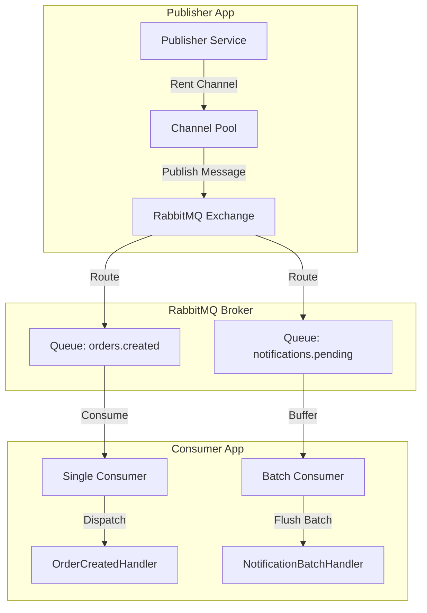

<p align="center">
  
  <h1 align="center">RabbitFlow</h1>
  <p align="center">
    <b>Enterprise-grade, high-throughput RabbitMQ client framework for .NET 8, 9, and 10</b>
  </p>
  <p align="center">
    <a href="#-features">Features</a> •
    <a href="#-architecture">Architecture</a> •
    <a href="#-installation">Installation</a> •
    <a href="#-quick-start">Quick Start</a> •
    <a href="#-advanced-capabilities">Advanced Capabilities</a> •
    <a href="#-configuration-reference">Configuration</a> •
    <a href="#-observability--metrics">Metrics</a>
  </p>
</p>

<p align="center">
  <a href="https://dotnet.microsoft.com/"></a>
  <a href="https://www.nuget.org/packages/RabbitFlow"></a>
  <a href="LICENSE"></a>
  <a href="https://opentelemetry.io/"></a>
</p>

---

## ⚡ Features

| Feature | Description |
| :--- | :--- |
| 🌐 **Multi-Broker Support** | Connect to multiple RabbitMQ brokers, clusters, or vhosts simultaneously within a single app. |
| ⚡ **Channel Pooling** | High-throughput producer channel reuse using `SemaphoreSlim` backpressure — eliminates *channel-per-publish* overhead. |
| 📦 **Batch Consumer** | Buffer high-volume messages in-memory and execute bulk processing with size/timeout triggers. |
| 🔄 **Event Versioning** | Transparently upgrade legacy event schemas to latest contracts via `IEventUpgrader<TFrom, TTo>` chains. |
| 🛡️ **Resilience & DLQ** | Built-in retry strategies with exponential backoff and automatic Dead-Letter Queue (DLQ) topology setup. |
| 📊 **Native OpenTelemetry** | Out-of-the-box distributed tracing (`ActivitySource`) and custom metrics (`Meter`). |
| 🩺 **Health Checks** | Native ASP.NET Core health check integration for individual connections and aggregate cluster health. |

---

## 🏗️ Architecture



---

## 📦 Installation

Install via .NET CLI:

```bash
dotnet add package RabbitFlow
```

Or Package Manager Console:

```powershell
Install-Package RabbitFlow
```

---

## 🚀 Quick Start

### 1️⃣ Configuration (`appsettings.json`)

```json
{
  "RabbitMQ": {
    "Connections": {
      "main": {
        "HostName": "localhost",
        "Port": 5672,
        "UserName": "guest",
        "Password": "guest",
        "VirtualHost": "/"
      }
    },
    "Producers": [
      {
        "ServiceKey": "orders",
        "ConnectionName": "main",
        "ExchangeName": "orders",
        "ExchangeType": "direct",
        "RoutingKey": "order-created",
        "ChannelPoolSize": 4
      }
    ],
    "Consumers": [
      {
        "ServiceKey": "orders-consumer",
        "ConnectionName": "main",
        "ExchangeName": "orders",
        "QueueName": "orders.created",
        "RoutingKey": "order-created",
        "PrefetchCount": 10,
        "MaxRetries": 3
      }
    ]
  }
}
```

---

### 2️⃣ Dependency Injection (`Program.cs`)

```csharp
using RabbitFlow.Abstractions;

var builder = WebApplication.CreateBuilder(args);

// Register RabbitMQ Core Services
builder.Services.AddRabbitMQ(builder.Configuration);

// Register Consumer Handlers
builder.Services.AddRabbitHandler<OrderCreatedHandler>("orders-consumer");

// Configure OpenTelemetry (Optional)
builder.Services.AddOpenTelemetry()
    .WithTracing(t => t.AddSource(RabbitMqActivitySource.SourceName))
    .WithMetrics(m => m.AddMeter(RabbitMqMetrics.MeterName));

var app = builder.Build();
app.Run();
```

---

### 3️⃣ Publishing Messages

```csharp
using RabbitFlow.Abstractions;

public record OrderCreatedEvent : IIntegrationEvent
{
    public Guid OrderId { get; init; }
    public string CustomerEmail { get; init; } = string.Empty;
}

public class OrderService(IEventPublisher publisher)
{
    public async Task CreateOrderAsync(Guid orderId, string email)
    {
        await publisher.PublishAsync(new OrderCreatedEvent
        {
            OrderId = orderId,
            CustomerEmail = email
        });
    }
}
```

---

### 4️⃣ Consuming Messages

```csharp
using RabbitFlow.Abstractions;

public class OrderCreatedHandler(ILogger<OrderCreatedHandler> logger) : IRabbitHandler<OrderCreatedEvent>
{
    public string ConsumerKey => "orders-consumer";

    public Task HandleAsync(OrderCreatedEvent @event, MessageContext context)
    {
        logger.LogInformation(
            "Processing Order {OrderId} | CorrelationId: {CorrelationId}",
            @event.OrderId, 
            context.CorrelationId);

        return Task.CompletedTask;
    }
}
```

---

## 💎 Advanced Capabilities

### 📥 Batch Consumer

Process high-throughput workloads (e.g., bulk database inserts) by accumulating messages in-memory.

> **Tip:** Use batch processing when throughput exceeds **5,000 msg/sec** to drastically reduce I/O bottlenecks.

```json
{
  "Consumers": [{
    "ServiceKey": "notifications-batch",
    "ConnectionName": "main",
    "ExchangeName": "notifications",
    "QueueName": "notifications.pending",
    "RoutingKey": "#",
    "EnableBatchConsumer": true,
    "BatchSize": 50,
    "BatchTimeoutMs": 3000,
    "PrefetchCount": 100
  }]
}
```

```csharp
builder.Services.AddBatchRabbitHandler<NotificationBatchHandler>("notifications-batch");

public class NotificationBatchHandler : IBatchRabbitHandler<NotificationEvent>
{
    public string ConsumerKey => "notifications-batch";

    public async Task HandleBatchAsync(
        IReadOnlyList<NotificationEvent> events,
        IReadOnlyList<MessageContext> contexts)
    {
        // Bulk Operation (e.g., EF Core AddRangeAsync / Dapper ExecuteAsync)
        await SaveNotificationsToDbAsync(events);
    }
}
```

---

### 🏊 Channel Pooling

By default, each producer holds a managed pool of AMQP channels. Publishes rent a channel, execute the operation, and return it back to the pool.

> **Important:** Creating and destroying channels per publish is the **#1 cause of throughput limits** in AMQP applications. Channel pooling eliminates this latency entirely.

| Pool Size | Publisher Confirms | Estimated Throughput |
| :---: | :---: | :---: |
| **4** | Enabled | `40,000` – `80,000` msg/s |
| **8** | Enabled | `80,000` – `150,000` msg/s |
| **4** | Disabled | `100,000` – `200,000` msg/s |
| **0** | — | Channel-per-publish *(Backward compatibility)* |

---

### 🔀 Event Versioning

Upgrade historical message contracts without disrupting running production consumers.

```csharp
[EventVersion("OrderCreated", 1)]
public record OrderCreatedV1(Guid OrderId, string Email);

[EventVersion("OrderCreated", 2)]
public record OrderCreatedV2(Guid OrderId, string Email, string Phone);

// Upgrader definition
public class OrderV1ToV2Upgrader : IEventUpgrader<OrderCreatedV1, OrderCreatedV2>
{
    public string EventName => "OrderCreated";
    public int FromVersion => 1;
    public int ToVersion => 2;

    public OrderCreatedV2 Upgrade(OrderCreatedV1 source)
        => new(source.OrderId, source.Email, Phone: "N/A");
}

// Registration
builder.Services.AddEventUpgrader<OrderV1ToV2Upgrader>();